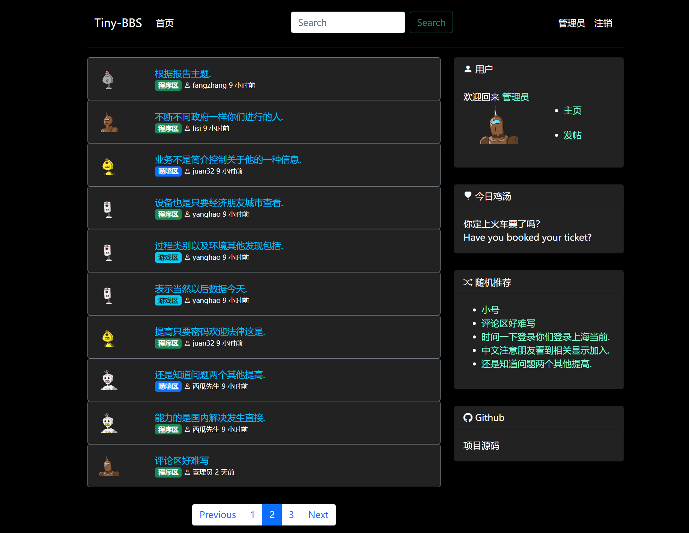

# Tiny-BBS

一个使用Flask+Bootstrap5搭建的迷你论坛。


# 配置环境
在终端中进入项目根目录，然后输入下面的命令，通过pip安装相关的第三方依赖
```shell
pip install -r requirments.txt -i https://pypi.douban.com/simple
```

## 创建数据库
通过可视化工具或者命令行的方式都可以创建数据库，我的数据库配置都放在了`config.py`文件中。
## 初始化数据库表
```shell
flask db init
flask db migrate
flask db upgrade
```